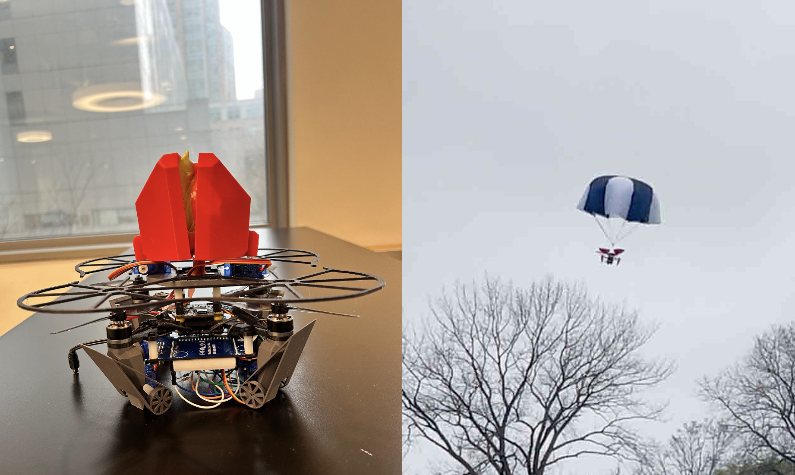

# Drone Failsafe Parachute System


An emergency recovery system for UAVs that detects in-flight failures and autonomously deploys a parachute and retractable landing gear for controlled descent — no pilot intervention required.

Built for the Mechatronics course (ROB-GY 5103) at NYU Tandon School of Engineering.

## Demo

<p align="center">
  
</p>

> Videos: [`demo_video.mp4`](assets/videos/demo_video.mp4) · [`landing_gear_testing_video.mp4`](assets/videos/landing_gear_testing_video.mp4) · [`updated_demo.mp4`](assets/videos/updated_demo.mp4)

## How It Works

The system runs three concurrent processes on the Parallax Propeller's multi-core (cog) architecture:

**Stage 1 — Failure Detection (Cog 2: IMU)**

1. MPU6050 reads Z-axis acceleration at 20 Hz via I2C
2. Computes jerk (rate of change of acceleration) between consecutive readings
3. Triggers emergency flag when jerk exceeds threshold (9000 units)

**Stage 2 — Parachute Deployment (Main Cog)**

1. Main loop detects jerk flag from IMU cog
2. Servo on Pin 2 rotates from 90° to 180°, releasing parachute
3. Topology-optimized plates open to allow clean chute separation

**Stage 3 — Landing Gear Deployment (Cog 1: Ultrasonic)**

1. HC-SR04 on Pin 3 continuously measures ground distance via pulse timing
2. When distance drops below 35 cm, servo on Pin 4 actuates landing gear
3. Spring-suspended 3D-printed gear absorbs remaining impact force

## System Architecture

```
┌──────────────────────────────────────────────────┐
│               Parallax Propeller                 │
│            (Multi-Cog Architecture)              │
├────────────┬─────────────┬───────────────────────┤
│   Cog 0    │    Cog 1    │        Cog 2          │
│  Main Loop │  Ultrasonic │     IMU Reader         │
│            │  measure_   │     read_imu()         │
│  - Reads   │  distance() │                        │
│    flags   │             │  - MPU6050 Z-accel     │
│  - Actuates│  - HC-SR04  │  - Jerk computation    │
│    servos  │    ping     │  - Sets jerk_detected  │
│            │  - Updates  │    flag                 │
│            │   distance  │                        │
├────────────┼─────────────┼───────────────────────┤
│  P0/P1     │     P3      │    P2         P4       │
│  (I2C)     │   (GPIO)    │  (Servo)    (Servo)    │
│    │       │     │       │    │          │        │
│  ┌─┴──┐   │  ┌──┴───┐   │ ┌──┴───┐  ┌──┴───┐   │
│  │IMU │   │  │Ultra │   │ │Chute │  │Gear  │   │
│  │6050│   │  │sonic │   │ │Servo │  │Servo │   │
│  └────┘   │  └──────┘   │ └──────┘  └──────┘   │
└────────────┴─────────────┴───────────────────────┘
          ↑ 5V from Buck Converter
          ↑ 8.4V LiPo Battery
```

## Project Structure

```
├── firmware/
│   ├── final_Project_2_code.c       # Main firmware — multi-cog control loop
│   └── final_Project_2_code.side    # SimpleIDE project config
├── assets/
│   ├── images/
│   │   └── parachute.png            # System overview image
│   └── videos/
│       ├── demo_video.mp4           # Full system demo
│       ├── updated_demo.mp4         # Updated demo with improvements
│       ├── landing_gear_testing_video.mp4
│       ├── parachute_overview.mp4   # Parachute mechanism overview
│       └── raw_test_footage.MOV     # Unedited test footage
└── README.md
```

## Components

| Component | Model | Qty | Purpose |
|-----------|-------|-----|---------|
| Microcontroller | Parallax Propeller | 1 | Real-time multi-cog processing |
| IMU | MPU6050 | 1 | Instability / jerk detection |
| Ultrasonic Sensor | HC-SR04 | 1 | Ground proximity measurement |
| Servo Motor | MG995 | 6 | Parachute (2) + Landing gear (4) |
| Battery | 8.4V LiPo | 1 | Main power supply |
| Buck Converter | — | 1 | 8.4V → 5V regulation |
| Drone Components | Frame, FC, ESC, Motors | — | Flight platform |

**Total Estimated Cost: ~$332**

## Circuit Connections

| Peripheral | Pin | Protocol |
|-----------|-----|----------|
| IMU (SDA/SCL) | P0, P1 | I2C |
| Ultrasonic (Trig/Echo) | P3 | GPIO |
| Landing Gear Servo | P4 | PWM |
| Parachute Servo | P2 | PWM |

## Key Design Decisions

- **Multi-cog concurrent sensing** — IMU and ultrasonic run on dedicated Propeller cogs for true parallel real-time processing with zero blocking
- **Jerk-based detection over tilt** — Computing acceleration derivative catches sudden failures (motor loss, ESC burnout) faster than absolute tilt thresholds
- **Mars-Rover-inspired descent sequencing** — Multi-stage deployment (detect → chute → gear) mirrors proven planetary landing strategies
- **Topology-optimized plates** — Reduced weight while maintaining structural integrity; minimizes drag from propeller airflow
- **Spring-suspended landing gear** — Absorbs residual impact force that the parachute alone cannot eliminate

## Results

- Prototype successfully detects imbalance and deploys parachute autonomously
- Controlled tests show significant reduction in landing impact force
- Landing gear deployment triggers reliably at distance threshold
- System responds to simulated motor failure, ESC burnout, and signal loss scenarios

## Future Work

- AI-based predictive stability control for preemptive deployment
- Machine learning models to optimize deployment timing based on environmental conditions
- Deployable air cushions and shock-absorbing retractable gear
- Biodegradable parachute materials for sustainability
- Integration with commercial drone platforms for regulatory compliance

## Stack

`Parallax Propeller (C)` · `SimpleIDE` · `MPU6050 IMU` · `HC-SR04 Ultrasonic` · `MG995 Servos` · `SolidWorks` · `3D Printing (PLA-CF)` · `LiPo Power System`

## Team

Tarunkumar Palanivelan · Sven Sunny · Abirami Palaniappan · Sirsabesan

## License

This project is licensed under the [MIT License](LICENSE).
