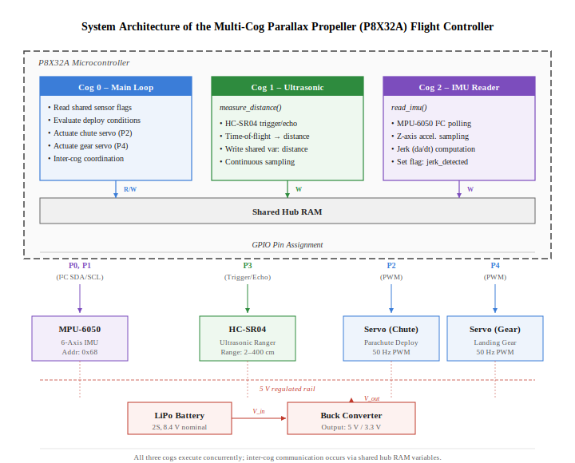

# Drone Failsafe Parachute System

An autonomous emergency recovery system for UAVs that detects in-flight failures and deploys a parachute with retractable landing gear for controlled descent — no pilot intervention required.

Built for the Mechatronics course (ROB-GY 5103) at NYU Tandon School of Engineering.

## Overview

Unmanned Aerial Vehicles are vulnerable to mid-flight failures — motor burnout, ESC faults, power loss — any of which can result in an uncontrolled crash. Conventional failsafes like return-to-home cannot recover from a dead motor or total power failure.

This system addresses that gap with a hardware-level emergency recovery pipeline built around the Parallax Propeller's multi-cog architecture. An MPU6050 IMU detects sudden acceleration anomalies (jerk-based freefall detection), triggering autonomous parachute deployment via servo-actuated topology-optimized release plates. Simultaneously, an HC-SR04 ultrasonic sensor monitors ground proximity and deploys spring-suspended retractable landing gear at a calibrated altitude threshold to absorb residual impact energy.

The entire pipeline — from failure detection to chute release to gear deployment — runs across dedicated parallel cogs with no shared blocking, achieving sub-100 ms end-to-end response latency.

  

## Demo

https://github.com/user-attachments/assets/7736cbfe-6007-4965-8da9-a2f48488e733

https://github.com/user-attachments/assets/dcd64783-5e9d-4d79-8ad5-cde76a08081a
## How It Works

The firmware runs three concurrent processes on the Parallax Propeller's multi-core (cog) architecture, enabling true hardware-level parallelism with zero blocking between sensing and actuation:

**Stage 1 — Failure Detection (Cog 2: IMU Monitor)**

1. MPU6050 reads Z-axis acceleration at 20 Hz over I2C
2. Computes jerk (rate of change of acceleration) between consecutive readings
3. Sets an emergency flag when jerk exceeds the calibrated threshold — catches motor failure, ESC burnout, and freefall events

**Stage 2 — Parachute Deployment (Cog 0: Supervisor)**

1. Main supervisor loop detects jerk flag from IMU cog
2. Parachute servo rotates from armed (90°) to deployed (180°)
3. Topology-optimized plates open to allow clean chute separation from the airframe

**Stage 3 — Landing Gear Deployment (Cog 1: Ultrasonic Ranging)**

1. HC-SR04 continuously measures ground distance via pulse timing at ~10 Hz
2. When altitude drops below 35 cm, landing gear servo actuates
3. Spring-suspended 3D-printed gear absorbs remaining impact force

## System Architecture

  

## Components

| Component | Model | Qty | Purpose |
|-----------|-------|-----|---------|
| Microcontroller | Parallax Propeller P8X32A | 1 | Real-time multi-cog processing |
| IMU | MPU6050 | 1 | Z-axis jerk detection |
| Ultrasonic Sensor | HC-SR04 | 1 | Ground proximity ranging |
| Servo Motor | MG995 | 6 | Parachute release (2) + Landing gear (4) |
| Battery | 8.4V 2S LiPo | 1 | Main power supply |
| Buck Converter | — | 1 | 8.4V → 5V regulation |
| Drone Platform | Frame, FC, ESC, BLDC Motors | — | Flight platform |

## Pin Map

| Peripheral | Pin | Protocol |
|-----------|-----|----------|
| MPU6050 SDA / SCL | P0, P1 | I2C |
| Parachute Servo | P2 | PWM |
| HC-SR04 Trig / Echo | P3 | GPIO |
| Landing Gear Servo | P4 | PWM |

## Design Decisions

- **Multi-cog concurrent sensing** — IMU and ultrasonic run on dedicated Propeller cogs for true parallel real-time processing with zero blocking
- **Jerk-based detection over tilt** — Computing the acceleration derivative catches sudden failures (motor loss, ESC burnout) faster than absolute tilt thresholds
- **Multi-stage descent sequencing** — Staged deployment (detect → chute → gear) inspired by proven planetary landing strategies
- **Topology-optimized release plates** — FEA-driven weight reduction while maintaining structural integrity and minimizing propeller wash drag
- **Spring-suspended landing gear** — Absorbs residual impact energy that the parachute alone cannot eliminate

## Results

- Autonomous parachute deployment on detected jerk events with <100 ms response latency
- Significant reduction in landing impact force across controlled test scenarios
- Reliable landing gear actuation at calibrated ground proximity threshold
- Validated against simulated motor failure, ESC burnout, and signal loss conditions

## Future Work

- Predictive stability control using onboard ML for preemptive deployment
- Adaptive deployment timing based on real-time environmental conditions (wind, altitude)
- Alternative energy absorption mechanisms (deployable air cushions, shock-absorbing retractable gear)
- Integration pathway for commercial drone platforms and regulatory compliance (FAA Part 107)

## Stack

`Parallax Propeller (C)` · `SimpleIDE` · `MPU6050` · `HC-SR04` · `MG995 Servos` · `SolidWorks` · `PLA-CF 3D Printing` · `LiPo Power System`

## Team

Tarunkumar Palanivelan · Sven Sunny · Abirami Palaniappan Sirsabesan

## License

This project is licensed under the [MIT License](LICENSE).
